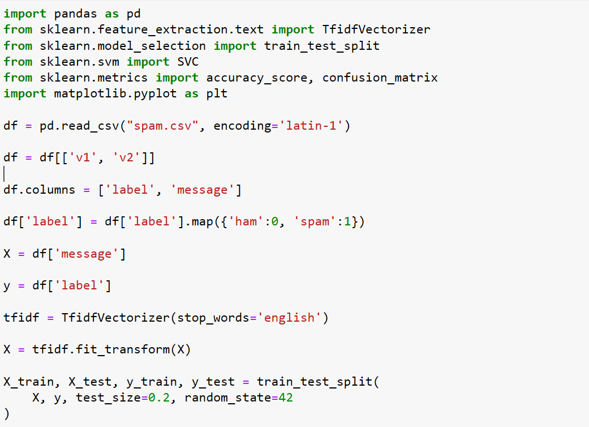
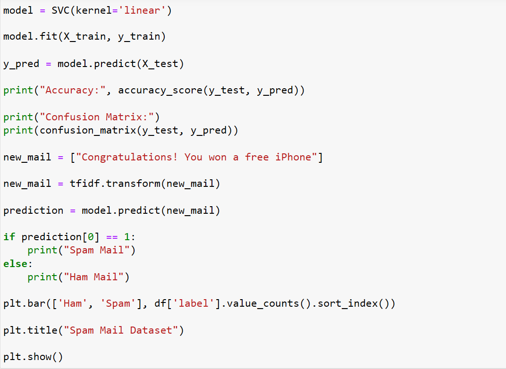
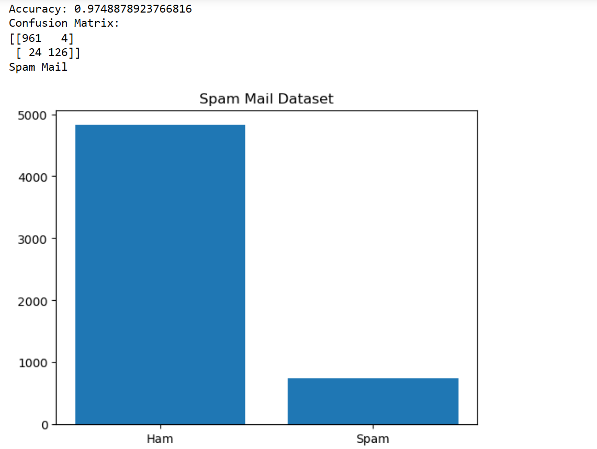

# Implementation-of-SVM-For-Spam-Mail-Detection

## AIM:
To write a program to implement the SVM For Spam Mail Detection.

## Equipments Required:
1. Hardware – PCs
2. Anaconda – Python 3.7 Installation / Jupyter notebook

## Algorithm

1.Import the packages.

2.Analyse the data.

3.Use modelselection and Countvectorizer to preditct the values.

4.Find the accuracy and display the result.

## Program:
```
/*
Program to implement the SVM For Spam Mail Detection..

# Import libraries
import pandas as pd
from sklearn.feature_extraction.text import TfidfVectorizer
from sklearn.model_selection import train_test_split
from sklearn.svm import SVC
from sklearn.metrics import accuracy_score, confusion_matrix
import matplotlib.pyplot as plt

df = pd.read_csv("spam.csv", encoding='latin-1')

df = df[['v1', 'v2']]

df.columns = ['label', 'message']

df['label'] = df['label'].map({'ham':0, 'spam':1})

X = df['message']

y = df['label']

tfidf = TfidfVectorizer(stop_words='english')

X = tfidf.fit_transform(X)

X_train, X_test, y_train, y_test = train_test_split(
    X, y, test_size=0.2, random_state=42
)

model = SVC(kernel='linear')

model.fit(X_train, y_train)

y_pred = model.predict(X_test)

print("Accuracy:", accuracy_score(y_test, y_pred))

print("Confusion Matrix:")
print(confusion_matrix(y_test, y_pred))

new_mail = ["Congratulations! You won a free iPhone"]

new_mail = tfidf.transform(new_mail)

prediction = model.predict(new_mail)

if prediction[0] == 1:
    print("Spam Mail")
else:
    print("Ham Mail")

plt.bar(['Ham', 'Spam'], df['label'].value_counts().sort_index())

plt.title("Spam Mail Dataset")

plt.show()

Developed by: Swathi P N
RegisterNumber:  212225230279
*/
```

## Output:







## Result:
Thus the program to implement the SVM For Spam Mail Detection is written and verified using python programming.
